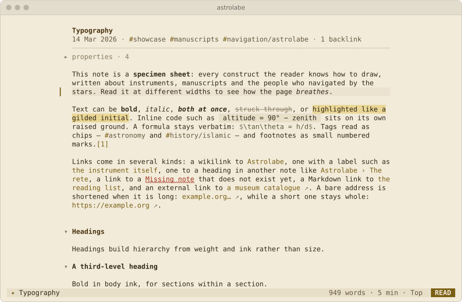
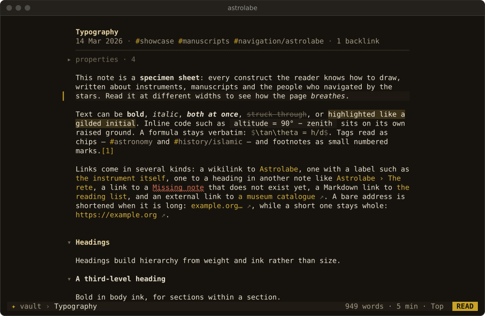
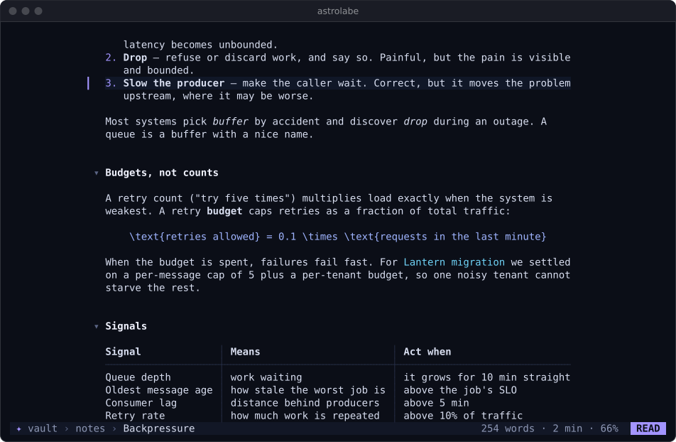

<p align="center"></p>

# astrolabe-cli

**Astrolabe for the terminal: your Markdown notes, beautifully, in one static binary.**

Astrolabe CLI is the terminal companion of the [Astrolabe](https://github.com/ZahakJ/astrolabe) web app, and works on the same vault without it: any folder of plain `.md` files, Obsidian vaults included. It has a reader that typesets your notes, a small Vim-style editor and a set of shell verbs for capture and search. The command is `astrolabe`; the installer also adds the short alias `ast`.


```sh
curl -fsSL https://raw.githubusercontent.com/ZahakJ/astrolabe-cli/main/install.sh | sh
# or
wget -qO- https://raw.githubusercontent.com/ZahakJ/astrolabe-cli/main/install.sh | sh
```

You can also download one file, `astrolabe-linux-amd64`, `astrolabe-linux-arm64`, `astrolabe-darwin-amd64` or `astrolabe-darwin-arm64`, from [Releases](https://github.com/ZahakJ/astrolabe-cli/releases), `chmod +x` it and put it on your `PATH`. Nothing else is needed.

- [Why](#why)
- [The first five minutes](#the-first-five-minutes)
- [Shell verbs](#shell-verbs)
- [Keymap](#keymap) (printable version: [docs/keymap.md](docs/keymap.md))
- [How notes are stored](#how-notes-are-stored) (Obsidian details: [docs/obsidian.md](docs/obsidian.md))
- [Terminals](#terminals)
- [With tmux and Neovim](#with-tmux-and-neovim) (more snippets: [docs/integration.md](docs/integration.md))
- [Themes and configuration](#themes-and-configuration)
- [Astrolabe CLI and Emacs](#astrolabe-cli-and-emacs)
- [Design decisions](#design-decisions)
- [Building from source](#building-from-source)

## Why

**Light.** Astrolabe CLI is a single static binary of about 5.5 MB with no runtime dependencies: no libc, no interpreter, no Nerd Font. It runs on old Linux machines, on macOS, over SSH and inside tmux. Your notes stay ordinary Markdown files in an ordinary folder. Astrolabe CLI keeps no database and no index on disk, and it adds no files to your notes folder. It opens an existing Obsidian vault as it is, and it never writes to `.obsidian/`.

**Quick.** Astrolabe CLI draws the note you asked for first and indexes the vault in the background. On a generated vault of 1,500 notes (7.9 MB), opening a 424-line note drew the first frame in 6–10 ms. The team measured 4–26 ms on a real vault of 1,525 notes. A whole `astrolabe find` run, including process start and reading every file, took 30–43 ms on the same 1,500 notes, and a capture with `astrolabe add` takes about 2 ms. To see the first-frame time on your own machine, run Astrolabe CLI with `ASTROLABE_DEBUG=1`.

**A page worth reading.** Terminals have only one font size, so the reader builds hierarchy from weight, colour, spacing and rules. Lines are kept to a readable width (78 columns by default) and centred. Headings have fold chevrons, and tables use hairline borders and re-flow to fit the width. Tasks show due-date chips and callouts get their own colours. Arabic is shaped and laid out right to left, even in terminals that cannot do this themselves. The same page also works with 16 colours, with plain ASCII, and in a pipe.

## The first five minutes

The repository includes a sample vault, so you can try everything below without touching your own notes. Its dates fall around early October 2026, so which tasks count as "overdue" depends on today's date.

1. **Install and check.** Run `astrolabe version`, then `astrolabe doctor`. `doctor` reports what Astrolabe CLI detected: colour depth, glyphs, bidi, which vault it chose and why, and your config file. It ends with a test card of colours and glyphs.

2. **Point it at notes.** Run Astrolabe CLI inside the sample vault (`git clone https://github.com/ZahakJ/astrolabe-cli && cd astrolabe-cli/examples/vault`), or inside your own Obsidian vault. Any folder that has `.obsidian/` or `.astrolabe/` above the current directory counts as a vault. Otherwise Astrolabe CLI uses `~/notes`. To make one vault the default everywhere, set `export ASTROLABE_DIR=~/notes` or put `dir = ~/notes` in the config file.

3. **Capture a thought from the shell.**

   ```console
   $ astrolabe add "call the plumber about the boiler"
   ✦ Added to daily/2026-10-04.md:3
     - 09:14 call the plumber about the boiler
   $ astrolabe add -t "renew passport due:2026-11-02 !!"
   ```

   Each capture appends exactly one line to today's daily note, which is created if needed. Nothing else in the file changes.

4. **Open the reader.** Run `astrolabe` with no arguments. It opens today's daily note if it exists, otherwise the last note you read, otherwise a home screen. To open a note by name, use `astrolabe Home` or `astrolabe "Lantern migration"`. A path, title, alias or unique fuzzy match all work. A gold `▎` in the left margin marks the cursor line:
   - `j` and `k` move it, and counts work (`5j`).
   - `Ctrl-d` and `Ctrl-u` move half a page; `gg` and `G` go to the top and bottom.
   - `]]` and `[[` jump between headings.
   - `za` folds the section under the cursor.

5. **Follow a link and come back.** Press `Tab` to highlight the next link and `Enter` to follow it. `Backspace` (or `Ctrl-o`, or `H`) goes back to the same place, and `L` goes forward again.
   - A broken link offers to create the note. A broken link to an attachment (`![[chart.png]]`, `report.pdf`) only says the attachment is missing.
   - A URL is shown and copied to the clipboard (OSC 52). Astrolabe CLI never opens it for you.

   

6. **Edit and save.**
   - Press `i` on any line and type. The built-in editor opens on that line's source in Insert mode, at the start of its text (after any list, task, quote or heading marker). `a` starts typing at the end of the line instead, and `e` opens the editor in Normal mode.
   - In the editor, Vim keys work as usual: `o` adds a new line, `A` appends, `u` undoes.
   - Press `Esc` twice to finish. The first `Esc` leaves Insert mode, and the second saves the file and returns to the reader at the same block.
   - To use your own editor, press `E` instead. It opens `$VISUAL` or `$EDITOR` at that line, and Astrolabe CLI reloads the note when you quit it.

   

7. **Find a note.** Press `Ctrl-p` (or `Space f`) to fuzzy-search titles, paths and aliases. With an empty query the finder lists your recent notes. Press `Enter` to open the selected note.

   

8. **Search the text.** Press `Space /` and type. Results appear as you type, with titles first, then headings, then body lines, each with its line of context. Press `Enter` to jump to the hit. Inside the current note, `/`, `n` and `N` search as in Vim.

   

9. **Tick a task.** Put the cursor on a task and press `x`. Astrolabe CLI rewrites the single character between the brackets in the file and nothing else.

10. **See the agenda.** Press `Space t` to list every open task in the vault, grouped as Overdue, Today, Upcoming and Undated. In the agenda, `x` toggles a task and `Enter` jumps to it.

    

11. **Capture without leaving the page.** Press `Space c`, type, and press `Enter`. `Tab` switches between a plain note line and a task.

    

To learn the rest, press `?` for every reader key, or press `Space` and wait a moment to see the leader keys. Press `q` to quit.

## Shell verbs

The verbs follow these rules:

- Results go to stdout and messages to stderr.
- When stdout is not a terminal, the output is plain and stable: `path:line:text` or tab-separated columns, and every list verb also accepts `--json`.
- In a pipe, paths are relative to the current directory when you are inside the vault, and absolute otherwise, so they always open as printed.

| Verb | What it does | Output in a pipe |
|---|---|---|
| `astrolabe` | open the reader: today's daily note, else the last note, else home | |
| `astrolabe NOTE` | open a note by path, title, alias, `NOTE:LINE`, `Note#Heading` or unique fuzzy match | |
| `astrolabe -` | page Markdown from stdin (read-only) | |
| `astrolabe add TEXT…` | append `- HH:MM text` to today's daily note. Reads stdin if no TEXT is given. `-t` adds a task, `-n NOTE` targets another note, `--at HEADING` adds to the end of that section | `path:line` |
| `astrolabe new TITLE…` | create a note and print its path. Piped stdin becomes the body. `-d DIR` picks the folder, `-e` opens it in `$EDITOR`, `-o` in the built-in editor | absolute path |
| `astrolabe today` | open today's daily note (created if missing). `-p` prints its path instead | absolute path |
| `astrolabe find QUERY…` | full-text search. `-l` prints paths only, `-n N` limits results, `--json` | `path:line:text` |
| `astrolabe ls [QUERY]` | notes, most recently modified first. `--tag T`, `-l`, `-n N`, `--json` | `path⇥YYYY-MM-DD HH:MM⇥title` |
| `astrolabe pick [QUERY]` | interactive fuzzy picker that prints the chosen absolute path | absolute path |
| `astrolabe tasks` | open tasks grouped by due date. `--all`, `--due`, `--json` | `path:line:[ ] text due:DATE !!` |
| `astrolabe tags` | tags with note counts. `-c` sorts by count | `tag⇥count` |
| `astrolabe links NOTE` | outgoing links, resolved. `-l`, `--json` | `line⇥kind⇥destination` |
| `astrolabe backlinks NOTE` | incoming links, each with the line that links | `path:line:context` |
| `astrolabe render [FILE\|NOTE\|-]` | typeset Markdown: ANSI on a terminal, plain text in a pipe. `-w COLS` sets the width | text |
| `astrolabe export NOTE` | one standalone HTML file. `-o FILE` writes to a file | HTML |
| `astrolabe path [NOTE]` | the vault root, or a note's absolute path | absolute path |
| `astrolabe doctor` | detected terminal capabilities, vault, config, warnings and a test card | |
| `astrolabe help [VERB]`, `astrolabe version` | the manual for one verb; the version | |

These global flags go before or after the verb: `-C DIR` (or `--dir`), `--theme NAME`, `--color auto|truecolor|256|16|none`, `--ascii` and `--bidi auto|on|off|runs`. Astrolabe CLI honours `NO_COLOR`. The verb names are reserved, so to open a note named after a verb, give its path: `astrolabe ./add.md`. A first argument that names no note but is close to a verb gets a suggestion before any note matches: `astrolabe tsks` prints ``did you mean `astrolabe tasks`?``.

**Search syntax.** Terms are ANDed. Matching is by substring and smart-case: case is ignored unless a term contains a capital letter. Quote a phrase to match it as one term. Filters:

- `re:PATTERN` matches a Go regular expression.
- `tag:x` keeps notes tagged x.
- `path:x` keeps notes whose path contains x.
- `title:x` keeps notes whose title or an alias contains x.

**Exit status.**

| Code | Meaning |
|---|---|
| 0 | success |
| 1 | nothing found (`find`, `ls`, `tasks`), or no note matches the name |
| 2 | usage error |
| 130 | cancelled (`Esc` in `astrolabe pick`) |

Some real output, from the sample vault:

```console
$ astrolabe find cutover | head -3
runbooks/Lantern cutover.md:2:Lantern cutover
runbooks/Lantern cutover.md:7:# Lantern cutover
projects/Lantern migration.md:33:3. **Cutover** — flip consumers queue by queue, smallest first. The

$ astrolabe links "Lantern migration" | head -3
16	embed	attachments/lantern-topology.svg
34	wikilink	runbooks/Lantern cutover.md
41	wikilink	notes/Idempotency keys.md

$ astrolabe links Typography | grep broken
25	broken	Missing note

$ astrolabe tasks | head -3
Typography.md:83:[ ] Transcribe the colophon of the Leiden copy due:2026-02-01
Inbox.md:11:[ ] Renew the staging TLS certificate due:2026-10-02 !!
daily/2026-10-02.md:5:[ ] Renew the staging TLS certificate due:2026-10-02 !!

$ astrolabe find zzz; echo $?
1
```

In a terminal the same verbs print grouped, aligned and lightly coloured output instead. Lines are shown as the reader shows them, without `[[…]]`, `**` or list markers, and Arabic is shaped and reordered when bidi is on; only the piped form above is raw:

```console
$ astrolabe tasks --due
  Overdue · 5
    ☐  Transcribe the colophon of the Leiden copy             1 Feb        Typography
    ☐  Renew the staging TLS certificate !!                   2 Oct        Inbox
    …
  Today · 1
    ☐  Compare plate latitudes with the gazetteer             today        Typography
```

**Aliases and snippets** for your shell rc:

```sh
alias n='astrolabe add'                   # n "idea"
alias nt='astrolabe add -t'               # nt "reply to the vendor due:2026-10-09"
alias nf='astrolabe find'
np() { f=$(astrolabe pick "$@") && nvim "$f"; }     # pick a note, edit it in Neovim

nvim -q <(astrolabe find deploy)          # every hit in the quickfix list
pbpaste | astrolabe add                   # capture the clipboard (macOS)
git log --oneline -20 | astrolabe new "Release notes draft"
astrolabe ls -l --tag meeting | while IFS= read -r f; do grep -l rollback "$f"; done
```

To log every commit to your daily note, save this as `.git/hooks/post-commit` and make it executable:

```sh
#!/bin/sh
astrolabe add "$(basename "$(git rev-parse --show-toplevel)"): $(git log -1 --format=%s)" >/dev/null
```

This writes a line such as `- 14:02 astrolabe: Fix the retry budget`. A hook runs inside the repository, so set `ASTROLABE_DIR` or the config key `dir`. Otherwise a repository that contains `.md` files would be taken as the vault (see [Vault root](#how-notes-are-stored)).

Note paths can contain spaces, so use `while IFS= read -r f` or `tr '\n' '\0' | xargs -0` rather than plain `xargs` (`xargs -d '\n'` is GNU only; macOS lacks it).

## Keymap

These tables come from Astrolabe CLI's keymap and help. [docs/keymap.md](docs/keymap.md) is the same material laid out for printing, plus the keys inside overlays and panels.

### Reader

A line cursor (`▎`) moves over the rendered lines, and actions apply to the block under it. A count typed before a key repeats it.

| Keys | Action |
|---|---|
| `j` `k`, `↓` `↑` | cursor down / up (counts: `5j`) |
| `Ctrl-d` `Ctrl-u` | half page down / up |
| `Ctrl-f` `Ctrl-b`, `PgDn` `PgUp` | page down / up |
| `gg`, `Home` | top (with a count, `12gg` goes to source line 12) |
| `G`, `End` | bottom (`12G` also goes to source line 12) |
| `]]` `}` / `[[` `{` | next / previous heading |
| `l` `→` / `h` `←` | scroll a code block right / left |
| `Tab` / `Shift-Tab` | next / previous link (highlights it) |
| `Enter`, `gd`, `Ctrl-]` | follow the highlighted link, else the first link on the line. On a heading without a link, toggle its fold; on a footnote mark, jump to the note |
| `Backspace`, `Ctrl-o`, `H` | back in history |
| `L` | forward in history |
| `za` | fold or unfold the section under the cursor |
| `zc` / `zo` | fold / unfold the section |
| `zM` / `zR` | fold every section / unfold everything |
| `x` | toggle the task under the cursor |
| `i` | edit this block: the built-in editor opens in Insert mode at the start of the line's text |
| `a` | edit this block: Insert mode at the end of the line |
| `e` | edit this block: the built-in editor opens in Normal mode |
| `E` | open `$VISUAL` / `$EDITOR` at this line; reload on return |
| `/`, `n`, `N` | search inside the note, next / previous match |
| `Ctrl-p` | find a note |
| `Space f` | find a note (title, path, alias) |
| `Space /`, `Space s` | search the vault's text |
| `Space d` | today's daily note |
| `Space c` | capture a line to today's note |
| `Space n` | new note (asks for a title, opens it in the editor) |
| `Space t` | agenda: open tasks by due date |
| `Space #` | tags, then the notes with a tag |
| `Space b` / `Space o` | focus backlinks / outline in the context panel (press again to close it) |
| `Space e` | toggle the file tree |
| `Space r` | recent notes |
| `Space T` | cycle the theme (saved to the config file) |
| `Space y` | copy this note's wikilink |
| `Space q`, `q`, `ZZ` | quit (asks if there are unsaved edits) |
| `?` | help: every key, scrollable |
| `:` | command line (see below) |
| `Esc` | clear the highlighted link and search |
| `Ctrl-l` | redraw the screen |
| `Ctrl-z` | suspend (`fg` to return) |

If you press `Space` and wait 300 ms, a palette lists every `Space` binding. `Ctrl-c` does not quit; it reminds you that `q` does.

Commands typed after `:` in the reader. `Tab` completes command names, note names and theme names.

| Command | Action |
|---|---|
| `:e NOTE`, `:e` | open a note; with no argument, reload the current one |
| `:new [TITLE]` | create a note and open it in the editor |
| `:today` | today's daily note |
| `:theme [NAME]` | switch theme and save it to the config file; with no name, show the current theme |
| `:export [FILE]` | write the note as HTML (default `<name>.html` in the current directory, never inside the vault) |
| `:set wrap=N` | set the page width to N columns (20 or more) |
| `:set nu`, `:set nonu` | line numbers in the editor |
| `:N` | go to source line N |
| `:tags`, `:agenda` | the tags and agenda overlays |
| `:noh` | clear the search highlight |
| `:help` | the help overlay |
| `:q` | quit |

### Editor

The editor implements a deliberate subset of Vim, and every key in it behaves as it does in Vim. The status bar shows `NORMAL`, `INSERT`, `VISUAL` or `V-LINE`.

| Keys | Action |
|---|---|
| `i` `a` `I` `A` `o` `O` | enter Insert mode (`o` on a list item continues the list) |
| `Esc` | Insert → Normal. In Normal with nothing pending, it saves if the buffer changed and returns to the reader |
| `h j k l`, arrows | move. `j` and `k` move by display line on wrapped lines, and by source line with a count |
| `w b e W B E ge gE` | word motions |
| `0 ^ $ g_ \|` | line positions |
| `gg G {N}G` `{ }` `%` | file, paragraph, matching bracket |
| `f F t T ; ,` | find a character on the line |
| `H M L`, `Ctrl-d Ctrl-u Ctrl-f Ctrl-b Ctrl-e Ctrl-y`, `zz zt zb` | screen positions and scrolling |
| `d c y > < g~ gu gU` + motion | operators, with counts |
| `iw aw iW aW ip ap i" a" i' a' i( a( i[ a[ i{ a{ i< a< i\` a\`` | text objects |
| `dd cc yy D C Y x X s S r J gJ ~ p P` | line edits, put, join (`Y` yanks to the end of the line, as in Neovim) |
| `u`, `Ctrl-r`, `.` | undo, redo, repeat |
| `v`, `V`, `gv` | Visual, Visual-line, reselect |
| `/ ? n N * #` | search (incremental, smart-case, Vim's regex syntax) |
| `:s/a/b/g`, `:%s/a/b/g`, `:'<,'>s/…` | substitute, with ranges and the flags `g i I` |
| `"a`–`"z`, `"+`, `"_` | registers; `"+` copies to the system clipboard through the terminal (OSC 52) |
| `:w`, `Ctrl-s` | save |
| `:q`, `:q!`, `:wq`, `:x`, `ZZ`, `ZQ` | leave the editor (`:q!` and `ZQ` discard changes) |
| `:set nu`, `:set wrap=N` | line numbers, page width |

Insert mode adds help for Markdown:

- `Enter` continues a bullet, numbered item, task, quote or callout, and ends the list on an empty item.
- `Tab` and `Shift-Tab` indent and outdent a list item. Inside a table they move between cells and re-align the whole table.
- Typing `[[` opens a note completer. `Enter` or `Tab` inserts the link, and `Esc` keeps what you typed.
- `Ctrl-t` inserts the time as `YYYY-MM-DD HH:MM`.

## How notes are stored

**The files are the only state.** A note is a `.md` file, and its identity is its path relative to the vault. Its title is the frontmatter `title`, else its first H1, else the file name. Astrolabe CLI writes outside the vault in only two places:

- `~/.config/astrolabe-cli/config`, which you write yourself; Astrolabe CLI changes it only when you change the theme from inside the TUI.
- `~/.local/state/astrolabe-cli/recent`, which holds recent notes and the last position in each. Losing it loses nothing.
- `~/.local/state/astrolabe-cli/recovered/`, only if Astrolabe CLI is killed with unsaved edits it could not write to the note (see Data safety below).

These follow `$XDG_CONFIG_HOME` and `$XDG_STATE_HOME`.

**Vault root.** Astrolabe CLI picks the first of these that applies:

1. `-C DIR`
2. `$ASTROLABE_DIR`
3. config `dir`
4. the nearest parent directory with `.obsidian/` or `.astrolabe/`
5. `~/notes`, if it exists
6. the current directory, if it holds `.md` files
7. otherwise `~/notes`, created on the first write

On the first interactive run in a fresh `~/notes`, Astrolabe CLI writes a short `Welcome.md` that teaches the tool. Run `astrolabe doctor` to see which rule chose your vault.

**Data safety.**

- **Writes are atomic.** Astrolabe CLI writes a temporary file in the same directory, syncs it and renames it over the original. The file mode is kept.
- **Edits are minimal.**
  - Ticking a task rewrites one character.
  - A capture appends one line.
  - Saving from the editor preserves line endings (LF or CRLF), the presence or absence of a final newline, a BOM, the frontmatter and any syntax Astrolabe CLI does not understand.
- **Conflicts are refused.** If the file changed on disk after Astrolabe CLI read it, saving does not overwrite it. A prompt offers `r` to reload theirs, `o` to overwrite with yours, or `c` to cancel.
- **Unsaved edits survive a closed window.** If Astrolabe CLI is ended by `SIGHUP` (the terminal window was closed, an SSH connection dropped) or `SIGTERM` while the editor has unsaved changes, it saves them to the note when the file has not changed on disk since it was read. Otherwise it writes them to `~/.local/state/astrolabe-cli/recovered/<timestamp>-<name>.md`, and the next start says where. `astrolabe doctor` lists recovered buffers until you delete them. Only an explicit discard (`:q!`, `ZQ`, "reload theirs", or answering yes to "Quit anyway?") throws edits away.
- **New notes never replace existing ones.** `astrolabe new` and `Space n` add ` 2`, ` 3` and so on to the name instead.
- **No network access.** Astrolabe CLI never touches the network at runtime.

**Obsidian compatibility.** Astrolabe CLI reads an Obsidian vault as it is:

- wikilinks in all forms: `[[Note]]`, `[[Note|label]]`, `[[Note#Heading]]`, `[[Note#^block]]`, `[[folder/Note]]`, all resolved the way Obsidian resolves them
- aliases, and frontmatter `title`, `tags`, `aliases`, `date` and `created`
- `#tags` and `#nested/tags`
- tasks with `[ ]`, `[x]`, `[/]` and `[-]`, due dates written `📅 2026-10-05`, `due:2026-10-05` or `@due(2026-10-05)`, and priorities written `!`, `!!` or with the emoji `⏫` `🔼` `🔽`
- callouts, including the `+` and `-` fold markers
- embeds: `![[Note]]` and `![[Note#Heading]]` show the first 12 lines; `![[image.png]]` shows a placeholder
- `==highlights==`, footnotes, `%% comments %%` and math (shown as source)
- the daily-notes settings in `.obsidian/daily-notes.json`

Astrolabe CLI does not run plugins, so it has no Dataview, Templater or Canvas. It shows no graph and no images. [docs/obsidian.md](docs/obsidian.md) has the full list.

## Terminals


- **Colour.** Astrolabe CLI detects truecolour, 256, 16 or no colour. Themes are written in 24-bit colour and reduced to the nearest of the 256-colour cube and grey ramp when needed. At 16 colours Astrolabe CLI uses your terminal's own foreground and background, with yellow as the accent and bold, italic, underline and reverse doing the rest. It paints no backgrounds there, so the page is correct on both light and dark terminals. `NO_COLOR` and `TERM=dumb` turn colour off. `--color` forces a level.
- **Glyphs.** All glyphs come from common monospace fonts; DejaVu Sans Mono, Menlo and Consolas are the floor. Astrolabe CLI uses no Nerd Font glyphs and no emoji of its own. When the locale is not UTF-8, or with `--ascii`, an ASCII set takes over: bullets become `*`, task boxes `[ ]`, bars `|`, rules `-`, chevrons `v` and `>`, and the ellipsis `...`.
- **Right-to-left text.** A paragraph whose first strong character is Arabic or Hebrew is right-aligned, and its bullets and quote bars move to the right edge. Terminals handle right-to-left text in one of three ways, and Astrolabe CLI has a behaviour for each (`--bidi auto|on|off|runs`, config `bidi`):
  - `on`: most terminals (foot, Alacritty, WezTerm, xterm, Windows Terminal, …) do no bidi at all. Astrolabe CLI reorders each line into visual order itself and shapes Arabic into joined letter forms, which then read correctly in any terminal that has the glyphs.
  - `runs`: kitty does no bidi either, but it lays out every stretch of right-to-left letters in one font right to left while shaping, which reverses each Arabic word a second time. In this mode Astrolabe CLI still reorders and shapes, and emits each such stretch pre-reversed, so kitty's own reversal puts it back. Colours, highlights and the cursor stay on the right cells.
  - `off`: terminals that implement bidi themselves (VTE-based ones such as GNOME Terminal and Tilix, Konsole, Apple Terminal, mlterm) get the logical order untouched.

  `auto` (the default) picks `runs` in kitty (`TERM=xterm-kitty`, `KITTY_WINDOW_ID`, `TERM_PROGRAM=kitty`; inside tmux, Astrolabe CLI asks tmux which terminal is attached), `off` in the bidi terminals listed above, and `on` elsewhere. `astrolabe doctor` prints the mode it chose and why, and the last line of its test card shows whether Arabic reads joined and right to left. Piped output is never reordered. One limit in `runs` mode: if your main font itself contains the Arabic letter forms, kitty folds punctuation touching an Arabic word into the same run, and that punctuation can land on the other side of the word. Harakat on presentation forms are drawn by the terminal's font and can sit slightly off in some fonts.

  

- **Small windows.** The page needs 40×10. Below 60 columns the status bar keeps only the note name and the mode. Panels toggled on in a narrow window overlay the page instead of squeezing it. Below the minimum, Astrolabe CLI shows "window too small" until the window grows.

  

- **tmux and SSH.** Astrolabe CLI relies on no passthrough and works in `tmux display-popup`. Each frame is a diff of changed cells, sent in one write inside synchronized-update marks, so it does not flicker over slow links. Clipboard copies use OSC 52. Inside tmux they need `set -g set-clipboard on`: with tmux's default, `external`, tmux ignores OSC 52 sent by applications. Hyperlinks (OSC 8) are emitted for terminals known to support them, including tmux 3.4 and later.
- **Mouse.** Mouse reporting is on only while the TUI runs. The wheel scrolls. In the reader a click places the cursor, follows a link or toggles a fold chevron; in the editor a click places the cursor. To let the terminal handle selection instead, set `mouse = off`, or hold Shift while selecting, which most terminals honour.
- **Suspend.** `Ctrl-z` suspends Astrolabe CLI and `fg` brings it back with the screen restored. `SIGINT`, `SIGTERM` and `SIGHUP` restore the terminal before Astrolabe CLI exits, after saving any unsaved editor buffer (see [Data safety](#how-notes-are-stored)); an internal crash restores the terminal too.
- **Minimal environments.** With `LANG=C` (or any non-UTF-8 locale) the interface glyphs fall back to the ASCII set, but note text is still read and written as UTF-8, so accented letters, Arabic and CJK in your notes come through unchanged if the terminal can show them. Under `TERM=dumb` the TUI still draws full-screen, without colour; the shell verbs print plain text there, as in a pipe.

## With tmux and Neovim

The snippets below were run against tmux 3.7 and Neovim 0.12. [docs/integration.md](docs/integration.md) has longer versions and variations.

**tmux.** Add to `~/.tmux.conf`. `prefix N` opens Astrolabe CLI in a popup, and `prefix a` / `prefix A` capture a line or a task without opening anything. The single quotes matter: inside double quotes tmux would expand `$line` itself when it reads the file.

```tmux
bind-key N display-popup -E -w 90% -h 90% -d '#{pane_current_path}' astrolabe
bind-key a display-popup -E -w 60% -h 3 -d '#{pane_current_path}' 'printf "capture: "; read -r line && [ -n "$line" ] && astrolabe add -- "$line" >/dev/null'
bind-key A display-popup -E -w 60% -h 3 -d '#{pane_current_path}' 'printf "task: "; read -r line && [ -n "$line" ] && astrolabe add -t -- "$line" >/dev/null'
```

Popups take tmux's global environment, not your shell's. If Astrolabe CLI lives in `~/.local/bin` and the popup cannot find it, add `set-environment -g PATH "$HOME/.local/bin:$PATH"` to the config, or write the full path. The `-d` flag runs Astrolabe CLI in the pane's directory so that project vaults are found; with `ASTROLABE_DIR` or `dir` set it makes no difference.

**Neovim as the external editor.** `E` in the reader runs `$VISUAL` or `$EDITOR` through `sh`, adding `+LINE` for vi, Vim, Neovim, nano, Emacs, micro, kak and similar editors, `file:LINE` for Helix, and `-g file:LINE` for VS Code. To make `i` open your editor too, set this in `~/.config/astrolabe-cli/config`:

```ini
editor = external
```

**Astrolabe CLI inside Neovim.** This Lua file, saved as `~/.config/nvim/lua/astrolabe.lua` and loaded with `require("astrolabe")`, opens the reader in a floating terminal, picks a note with Astrolabe CLI's finder and edits it in the current Neovim, and adds a `:Capture` command. It needs Neovim 0.11 or later (`jobstart` with `term = true`, and `vim.system`).

```lua
local function float(cmd, on_exit)
  local w, h = math.floor(vim.o.columns * 0.9), math.floor(vim.o.lines * 0.9)
  local buf = vim.api.nvim_create_buf(false, true)
  local win = vim.api.nvim_open_win(buf, true, {
    relative = "editor", style = "minimal", border = "rounded", width = w, height = h,
    row = math.floor((vim.o.lines - h) / 2), col = math.floor((vim.o.columns - w) / 2),
  })
  vim.fn.jobstart(cmd, { term = true, on_exit = function(_, code)
    if vim.api.nvim_win_is_valid(win) then vim.api.nvim_win_close(win, true) end
    if vim.api.nvim_buf_is_valid(buf) then vim.api.nvim_buf_delete(buf, { force = true }) end
    if on_exit then on_exit(code) end
  end })
  vim.cmd.startinsert()
end

vim.keymap.set("n", "<leader>nn", function() float({ "astrolabe" }) end, { desc = "astrolabe" })

vim.keymap.set("n", "<leader>np", function()
  local out = vim.fn.tempname()
  float({ "sh", "-c", "astrolabe pick > " .. vim.fn.shellescape(out) }, function(code)
    local path = code == 0 and vim.fn.readfile(out)[1] or nil
    vim.fn.delete(out)
    if path and path ~= "" then
      vim.schedule(function() vim.cmd.edit(vim.fn.fnameescape(path)) end)
    end
  end)
end, { desc = "astrolabe pick" })

vim.api.nvim_create_user_command("Capture", function(o)
  local r = vim.system({ "astrolabe", "add", "--", o.args }, { text = true }):wait()
  vim.notify(r.code == 0 and ("captured " .. vim.trim(r.stdout)) or vim.trim(r.stderr))
end, { nargs = "+" })
```

**Catppuccin.** The `mocha` theme uses the Catppuccin Mocha ground `#1e1e2e`, text `#cdd6f4` and mauve accent `#cba6f7`, so Astrolabe CLI matches a Catppuccin Neovim and tmux. Set it with `theme = mocha`.

### Wiring it into rihla

[rihla](https://github.com/ZahakJ/rihla) is a portable Neovim and tmux setup. These steps assume only that it has a tmux config file and a Neovim config directory; adjust the paths to its layout.

1. **Install Astrolabe CLI.** Make rihla's bootstrap run the installer, which needs no root and puts the binary in `~/.local/bin`:

   ```sh
   command -v astrolabe >/dev/null 2>&1 || curl -fsSL https://raw.githubusercontent.com/ZahakJ/astrolabe-cli/main/install.sh | sh
   ```

   On a machine without internet access, copy one release binary across and run `sh install.sh --from ./astrolabe-linux-amd64`.

2. **Configure tmux.** Add the three `bind-key` lines above to rihla's tmux config, plus `set-environment -g PATH "$HOME/.local/bin:$PATH"` if its popups do not already see `~/.local/bin`.

3. **Configure Neovim.** Add `astrolabe.lua` to rihla's Lua directory and `require` it from its `init.lua`. If rihla already maps `<leader>n…`, choose other keys.

4. **Set the theme.** rihla uses Catppuccin Mocha, so ship an Astrolabe CLI config that matches, written only if the user has none:

   ```sh
   mkdir -p "${XDG_CONFIG_HOME:-$HOME/.config}/astrolabe"
   [ -f "${XDG_CONFIG_HOME:-$HOME/.config}/astrolabe/config" ] || printf 'theme = mocha\neditor = external\n' > "${XDG_CONFIG_HOME:-$HOME/.config}/astrolabe/config"
   ```

   With `editor = external` and `EDITOR=nvim`, `i` and `E` in the reader both open Neovim.

5. **Set the vault.** Export `ASTROLABE_DIR` in rihla's shell profile if the notes are not in `~/notes`.


## Themes and configuration

There are six themes: `onyx` (the default: pure neutral greys with gold as the only accent, on the mark, bullets, links and bars), `iron-gall` (a warm near-black ground, ivory text and a gold accent), `parchment` (the light version of iron-gall), `graphite` (a neutral dark ground with the gold accent), `mocha` (Catppuccin) and `sidereal` (a deep blue-black night sky with violet and cyan; in 16 colours it uses magenta and cyan where the others use yellow). A test checks every theme for contrast: body text at least 7:1, muted text at least 4.5:1 and faint text at least 3:1. `Space T` cycles the themes, and `:theme NAME` picks one; both save the choice in the config file.







**Configuration is optional.** The file is `~/.config/astrolabe-cli/config` (`$XDG_CONFIG_HOME/astrolabe-cli/config`). It holds `key = value` lines, and `#` starts a comment. Every key can also be set by an environment variable `ASTROLABE_<KEY>`, which takes precedence over the file. `astrolabe doctor` warns once about unknown keys.

| Key | Values (default) | Effect | Override |
|---|---|---|---|
| `dir` | path | the vault, used when there is no `-C` | `ASTROLABE_DIR`, `-C DIR` |
| `theme` | `onyx` `iron-gall` `parchment` `graphite` `mocha` `sidereal` (`onyx`) | colours | `ASTROLABE_THEME`, `--theme` |
| `measure` | columns (`78`) | maximum width of the page text | `ASTROLABE_MEASURE`, `:set wrap=N` |
| `ground` | `on` `off` (`on`) | paint the theme's background at 256 colours and above; `off` keeps the terminal's own | `ASTROLABE_GROUND` |
| `bidi` | `auto` `on` `off` `runs` (`auto`) | how right-to-left text reaches the terminal: reordered and shaped (`on`), also pre-reversed for kitty (`runs`), or untouched (`off`) | `ASTROLABE_BIDI`, `--bidi` |
| `mouse` | `on` `off` (`on`) | mouse reporting in the TUI | `ASTROLABE_MOUSE` |
| `daily_dir` | folder (`daily`, or Obsidian's setting) | where daily notes live | `ASTROLABE_DAILY_DIR` |
| `daily_format` | Moment tokens (`YYYY-MM-DD`) | daily note file name; supports `YYYY YY MMMM MMM MM M DD D dddd ddd` | `ASTROLABE_DAILY_FORMAT` |
| `editor` | `builtin` `external` (`builtin`) | what `i`, `a` and `e` open | `ASTROLABE_EDITOR` |
| `ascii` | `on` `off` (`off`) | ASCII glyphs only | `ASTROLABE_ASCII`, `--ascii` |

Boolean values accept `on`/`off`, `true`/`false`, `yes`/`no` and `1`/`0`. `daily_dir` and `daily_format` override `.obsidian/daily-notes.json`. For example:

```ini
# ~/.config/astrolabe-cli/config
dir = ~/notes
theme = parchment
measure = 72
editor = external
```

**Other environment variables:**

- `NO_COLOR` turns colour off; `COLORTERM` and `TERM` are used to detect colour depth.
- `VISUAL`, then `EDITOR` (default `vi`), choose the external editor.
- `XDG_CONFIG_HOME` and `XDG_STATE_HOME` move the config and state files.
- `ASTROLABE_DEBUG=1` prints the first-frame time on exit and shows timings in the finder and search overlays.
- The installer reads `ASTROLABE_VERSION`, `ASTROLABE_BIN_DIR` and `ASTROLABE_BASE_URL`; see `sh install.sh --help`.

## Astrolabe CLI and Emacs

If you already have an Emacs notes setup with Org-mode, org-roam, org-agenda, org-capture or Denote, this section is a fair account of what you would gain and lose.

| | Astrolabe CLI | Emacs + Org / org-roam / Denote |
|---|---|---|
| Setup | none; one binary | an Emacs install plus packages and configuration, usually worth it once done |
| Start | a first frame in milliseconds | seconds for a large config, unless you keep a daemon and use `emacsclient` |
| Locked-down machine | download one file, `chmod +x` | needs Emacs installed, and packages fetched or vendored |
| Reading view | a typeset page: folds, tables, callouts, chips | the source buffer with font-lock; `org-modern` and similar packages narrow the gap |
| File format | plain Markdown, Obsidian-compatible | Org (Denote also supports Markdown and plain text) |
| Shell composition | every verb pipes: `path:line:text`, `--json`, exit codes | possible through `emacsclient --eval` or batch mode, not the usual way to work |
| Capture | `astrolabe add`, `Space c`, tmux popup | `org-capture` templates: far more flexible |
| Agenda | open tasks by due date; one date and a priority per task | scheduled and deadline dates, repeaters, habits, clocking, custom agenda views |
| Links and graph | wikilinks, backlinks with context, tags | org-roam's database, queries, backlink buffer and graph UIs |
| Literate code | none | Babel: run code blocks, tangle files |
| Export | standalone HTML, ANSI and plain text | HTML, LaTeX/PDF, ODT, Markdown and more through `ox` |
| Refile and archive | none; move files yourself | `org-refile`, `org-archive` |
| Tables | rendered; the editor re-aligns Markdown tables | Org tables with formulas, column view |
| Right-to-left text | reorders and shapes Arabic itself in terminals with no bidi | Emacs has its own bidi engine; shaping in a text terminal depends on the terminal |
| Extensibility | none: no plugins, no scripting | unlimited, in Lisp |
| Editor | a Vim subset, plus `$EDITOR` one key away | a complete editor, with Evil for Vim keys |

**Where Astrolabe CLI is better:**

- There is nothing to configure, and it starts at once.
- It runs on a machine where you cannot install anything.
- The reading view is designed to be read.
- The notes are plain Markdown that Obsidian, GitHub and every other Markdown tool also read.
- Every verb composes with the shell.
- Arabic is readable in terminals that do no bidi.

**What Astrolabe CLI does not do:**

- No Org-depth agenda: scheduling, repeaters, clocking and custom views.
- No Babel.
- No export to LaTeX, PDF or ODT.
- No refile or archive workflows.
- No org-roam graph or database queries.
- No column view or spreadsheet tables.
- No extension language.
- It is not a full editor.

**Stay on Emacs** if your agenda carries your week (scheduled items, repeaters, clocked time), if you rely on Babel or LaTeX export, or if your setup is your own Lisp. Astrolabe CLI cannot replace any of that, and it does not try to. Astrolabe CLI fits people who want their notes readable and searchable from any terminal in seconds, and whose notes are, or could be, Markdown.

**Neighbours.**

- [Obsidian](https://obsidian.md) is the graphical application whose vault format Astrolabe CLI follows. Many people will use both on the same folder.
- [glow](https://github.com/charmbracelet/glow) renders Markdown in the terminal, but it has no vault, links, tasks or editing.
- [nb](https://github.com/xwmx/nb) is a broad shell notebook with git-backed sync, bookmarks and encryption. Astrolabe CLI has no sync and a narrower scope.
- [zk](https://github.com/zk-org/zk) is a Zettelkasten CLI with a SQLite index and an LSP server for your editor. Astrolabe CLI keeps no index on disk and brings its own reader.
- Neovim plugins such as obsidian.nvim and render-markdown.nvim may be all you need if you never leave Neovim.

Astrolabe CLI sits between these: a reader and capture tool that works in any terminal, over the same files your other tools use.

## Design decisions

These are the choices behind Astrolabe CLI, for anyone evaluating it or working on it.

- **Go, with four dependencies.** Astrolabe CLI uses the standard library plus `golang.org/x/sys`, `x/term`, `x/text` and `github.com/rivo/uniseg`. There is no TUI framework, no Markdown library and no syntax-highlighting library. The terminal layer, the Markdown parser, the renderer, the highlighter and the editor are written for Astrolabe CLI. That keeps the binary small and static, and it gives full control over every cell on the page.
- **A built-in editor and `$EDITOR`.** A locked-down machine may have only `vi`, and the built-in editor understands Markdown lists, tables and `[[` links and keeps your place in the page. Your own editor is one key away (`E`), or always used with `editor = external`.
- **Separate reader and editor modes.** The rendered page is for reading and navigating; the source is for editing. Mixing the two makes both worse. Switching keeps your place: the editor opens on the source line of the block under the cursor, and leaving it returns to the same block.
- **No index on disk.** The files are the only state. Each run scans the vault in memory, which takes tens of milliseconds for 1,500 notes, so there is nothing to go stale, to rebuild, or to conflict in a sync tool. Search reads the files on every query. Files over 2 MB are indexed by title only.
- **The theme paints its own background.** In truecolour and 256 colours the page is a room with its own ground, so contrast is controlled. If you prefer your terminal's background, set `ground = off`. At 16 colours Astrolabe CLI never paints a background.
- **Bidi in Astrolabe CLI.** Astrolabe CLI reorders and shapes right-to-left text itself because most terminals do not. It steps aside for the terminals that implement bidi (`off`), and it compensates for kitty, which reverses each right-to-left run while shaping (`runs`). The `runs` transform is applied last, on the finished screen rows, so overlays, truncation and highlights need no special cases. Editing always happens in logical order; only the display is reordered.
- **Search folds Arabic.** Every search (finder, `astrolabe pick`, vault search, in-note `/`, completion, `astrolabe find`, `astrolabe ls`) compares a folded form of the query and the text: harakat, tatweel and invisible controls dropped, alef forms, alef maqsura, teh marbuta, hamza carriers and Persian letters unified, presentation forms and Arabic-Indic digits mapped to letters and ASCII digits. A query word also matches after the article and the attached particles (ال، وال، بال، و، ب، ل، ف، ك) as a word start. `re:` patterns stay literal.
- **Left out of version 1:** graph view, image display, sync, plugins or scripting, Org-style clocking and recurring tasks, a real table or spreadsheet editor, publishing, LaTeX rendering, multiple windows or splits in the editor, and Vim macros and marks.

## Verified on

Everything below was run on the real binary; captures were read by eye.

| Where | What | Result |
|---|---|---|
| Arch Linux host, private tmux server | Every reader and editor key in the keymap, finder, search, agenda, tags, capture, links, folds, task toggle, save, conflict prompt, `$EDITOR` round trip, suspend/resume, popup, stdin mode, `astrolabe pick`; sizes from 140×40 down to 40×10; truecolour, 256, 16 colours, `NO_COLOR`, `--ascii`; all four themes | pass |
| A 1,525-note Obsidian vault (long notes, wide tables, code, Arabic, Japanese) | Every note through `render` and `export`; TUI browse; checksum manifest before and after read-only use; task toggle, capture and new note on a writable copy | no failures; read-only use changed nothing; a task toggle changed one byte |
| `centos:7`, `rockylinux:9`, `debian:stable-slim`, `alpine` containers, fresh non-root user | `install.sh` over HTTP (curl and wget) and offline with `--from`; every verb; the TUI under a pty (open, follow a link, edit and save, capture, search) | pass |
| Real terminal windows on a Wayland desktop (screenshots read by eye, sample vault) | Arabic and mixed Arabic/English on the start page, reader, finder, vault search, in-note `/`, tags, agenda, tree, context panel, editor (Normal and Insert, typed Arabic, caret), `[[` completer, `astrolabe pick`, and CLI output — in **kitty 0.48** directly and inside tmux, and in **foot** directly and inside tmux | pass |
| Konsole (inside tmux) | The same surfaces with `bidi = off` | words read correctly, but Konsole's own whole-line bidi moves text across TUI columns; not recommended for right-to-left notes |
| CI | vet and tests on Linux and macOS; cross-build; the container smoke test | see the badge on the Actions tab |

Not verified: the macOS binaries have never been run by hand (the test suite
runs on a macOS CI runner, the pty tests are Linux-only); the arm64 binaries
are cross-compiled and unrun; containers share the host kernel, so CentOS 7's
3.10 kernel itself was not exercised. Right-to-left text was checked in real
kitty and foot windows only: WezTerm, Alacritty, Ghostty, iTerm2, GNOME
Terminal and Apple Terminal are untested, and a terminal that reverses
right-to-left runs like kitty but is not detected needs `--bidi runs`. In
kitty, punctuation touching an Arabic word can land on the wrong side when the
main font itself contains the Arabic glyphs, and a vowel mark on a lam-alef
ligature can render misplaced. The 256- and 16-colour looks of the new default
theme were checked in captures, not in real windows. Mouse clicks inside
overlays do nothing.

## Building from source

You need Go 1.22 or later.

```sh
git clone https://github.com/ZahakJ/astrolabe-cli && cd astrolabe-cli
make build          # ./astrolabe, static, stripped
make test           # go vet + go test ./...
make install        # into ~/.local/bin (PREFIX=... to change)
make dist           # all four release binaries and checksums.txt in dist/
```

`scripts/build.sh VERSION` is the release build. It runs `CGO_ENABLED=0 go build -trimpath -ldflags "-s -w -X main.version=VERSION"` for linux/amd64, linux/arm64, darwin/amd64 and darwin/arm64, then writes `dist/checksums.txt`. The design contract is [DESIGN.md](DESIGN.md).

## Licence

MIT. See [LICENSE](LICENSE).
