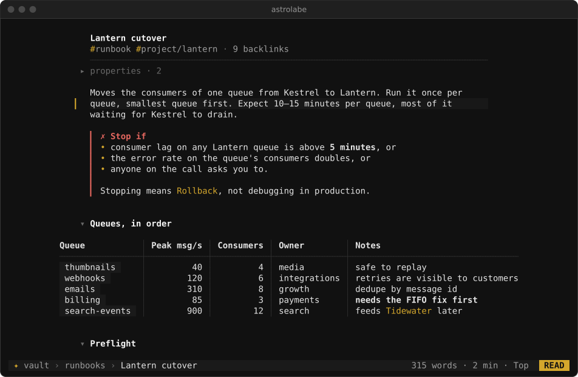
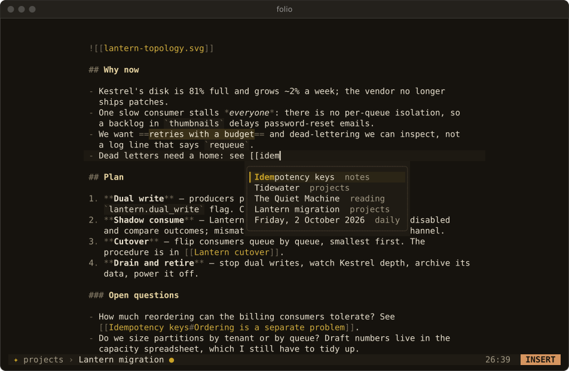

<p align="center"></p>

# astrolabe-cli

**Astrolabe for the terminal: your Markdown notes, beautifully, in one static binary.**

Astrolabe CLI is the terminal companion to [Astrolabe](https://github.com/ZahakJ/astrolabe), the notes app for the web, desktop and mobile, and it opens the same vault. It also works without Astrolabe, on any folder of plain `.md` files or an existing Obsidian vault. It has a reader that typesets your notes, a small Vim-style editor and a set of shell verbs for capture and search. The command is `astrolabe`; the installer also adds the short alias `ast`.



## Install

```sh
curl -fsSL https://raw.githubusercontent.com/ZahakJ/astrolabe-cli/main/install.sh | sh
```

With wget: `wget -qO- https://raw.githubusercontent.com/ZahakJ/astrolabe-cli/main/install.sh | sh`. Or download one file (`astrolabe-linux-amd64`, `-linux-arm64`, `-darwin-amd64`, `-darwin-arm64`) from [Releases](https://github.com/ZahakJ/astrolabe-cli/releases), `chmod +x` it and put it on your `PATH`. Nothing else is needed: the binary is about 5.5 MB, static, with no runtime dependencies and no Nerd Font. To build it yourself, see [Building from source](docs/building.md).

## Why

- **Light.** One static binary that runs on old Linux machines, on macOS, over SSH and inside tmux. Your notes stay ordinary Markdown files; there is no database, no index on disk and nothing added to your notes folder.
- **Quick.** The note you asked for is drawn first, in milliseconds, and the vault is indexed in the background. A capture takes about 2 ms.
- **A page worth reading.** Hierarchy from weight, colour and spacing, a readable measure, folding headings, re-flowing tables, due-date chips and callouts. Arabic is shaped and laid out right to left even in terminals that cannot do it themselves. The same page works in 16 colours, in plain ASCII and in a pipe.

## The first five minutes

The repository includes a sample vault in `examples/vault`, so you can try this without touching your own notes. The [full tour](docs/tour.md) has every step in more detail, with captures.

1. Run `astrolabe doctor`. It reports the colour depth, glyphs, bidi mode, which vault it chose and why, and ends with a test card.
2. Go to your notes: run `astrolabe -C ~/my-notes` once and that folder is remembered, so plain `astrolabe` opens it from anywhere (a folder with `.obsidian/` or `.astrolabe/` above where you stand still wins; the [full order](docs/obsidian.md#vault-root)). `astrolabe vault` shows which vault and why, and `astrolabe vault DIR` changes it.
3. Capture from the shell: `astrolabe add "call the plumber"` appends one line to today's daily note, and `astrolabe add -t "renew passport due:2026-11-02"` adds a task.
4. Run `astrolabe` to open the reader (today's note, else the last note), or `astrolabe "Lantern migration"` to open a note by title, path, alias or fuzzy match.
5. Move with `j` `k`, `Ctrl-d` `Ctrl-u`, `gg` `G`; jump between headings with `]]` `[[`; fold with `za`.
6. Press `Tab` to highlight a link, `Enter` to follow it, `Backspace` to come back.
7. Press `i` to edit the line under the cursor in the built-in editor. Vim keys work; `Esc` twice saves and returns to the same place. `E` opens `$EDITOR` instead.
8. Press `Ctrl-p` to find a note, and `Space /` to search the text of the whole vault.
9. Press `x` on a task to tick it, and `Space t` for the agenda of open tasks by due date.
10. Press `?` for every key, or `Space` and wait for the leader keys. `q` quits.



## Essential keys

| Reader | Action |
|---|---|
| `j` `k`, `Ctrl-d` `Ctrl-u` | cursor down / up, half page (counts work: `5j`) |
| `gg` `G` | top, bottom |
| `]]` `[[` | next / previous heading |
| `za` | fold or unfold the section |
| `Tab`, `Enter` | highlight the next link, follow it |
| `Backspace`, `L` | back, forward in history |
| `x` | toggle the task under the cursor |
| `i`, `E` | edit this block in the built-in editor, or in `$EDITOR` |
| `/`, `n` `N` | search in the note |
| `Ctrl-p`, `Space /` | find a note, search the vault |
| `Space c`, `Space t` | capture a line, open the agenda |
| `?`, `q` | help, quit |

The editor is a deliberate subset of Vim, and every key in it behaves as in Vim: motions, operators with counts, text objects, Visual mode, registers, `/` search and `:s`. `Esc` in Normal mode saves and returns to the reader; `:q!` discards. In Insert mode, `Enter` continues a list, `Tab` indents it or moves between table cells, and `[[` opens a note completer. The [keymap](docs/keymap.md) lists every key.

## Shell verbs

Results go to stdout, messages to stderr. In a pipe the output is plain `path:line:text` or tab-separated columns, and list verbs accept `--json`.

| Verb | Example |
|---|---|
| `add` | `astrolabe add -t "reply to the vendor due:2026-10-09"` appends to today's note |
| `new` | `git log --oneline -20 \| astrolabe new "Release notes"` creates a note |
| `find` | `astrolabe find 'tag:runbook rollback'` searches the full text |
| `ls` | `astrolabe ls --tag meeting` lists notes, newest first |
| `tasks` | `astrolabe tasks --due` lists open tasks by due date |
| `pick` | `nvim "$(astrolabe pick)"` picks a note interactively |
| `backlinks` | `astrolabe backlinks "Lantern migration"` shows incoming links |
| `render` | `astrolabe render Backpressure \| less -R` typesets a note |

Every verb, flag, exit code and the search syntax are in the [shell reference](docs/cli.md).

## Documentation

- [The first five minutes, in full](docs/tour.md): the guided tour with captures.
- [Keymap](docs/keymap.md): every key in the reader, overlays, panels and editor.
- [Shell reference](docs/cli.md): every verb and flag, search syntax, exit codes, sample output, aliases and snippets.
- [Configuration and themes](docs/configuration.md): every config key and environment variable, the six themes.
- [Terminals](docs/terminals.md): colour depths, ASCII fallback, right-to-left text and the three bidi modes, tmux and SSH, mouse, small windows.
- [Notes, storage and Obsidian vaults](docs/obsidian.md): where state lives, how the vault is chosen, the data-safety guarantees, and the Obsidian syntax understood and ignored.
- [Shell, tmux and Neovim](docs/integration.md): popups, a Neovim plugin file, git hooks, rihla.
- [Astrolabe CLI and Emacs](docs/vs-emacs.md): a comparison with Org, org-roam and Denote, and neighbouring tools.
- [Design decisions](docs/design-decisions.md): why it is built the way it is, and what is out of scope.
- [Verified on](docs/verified.md): where and how it was tested, and what was not.
- [Building from source](docs/building.md), and the design contract in [DESIGN.md](DESIGN.md).

## Status and licence

Every reader and editor key and every verb was run on the real binary on Linux, in CentOS 7 to Alpine containers, against a 1,525-note Obsidian vault, and in real kitty and foot windows for right-to-left text. The macOS binaries are tested only in CI and the arm64 binaries are cross-compiled; neither has been run by hand. Details are in [Verified on](docs/verified.md).

MIT. See [LICENSE](LICENSE).
