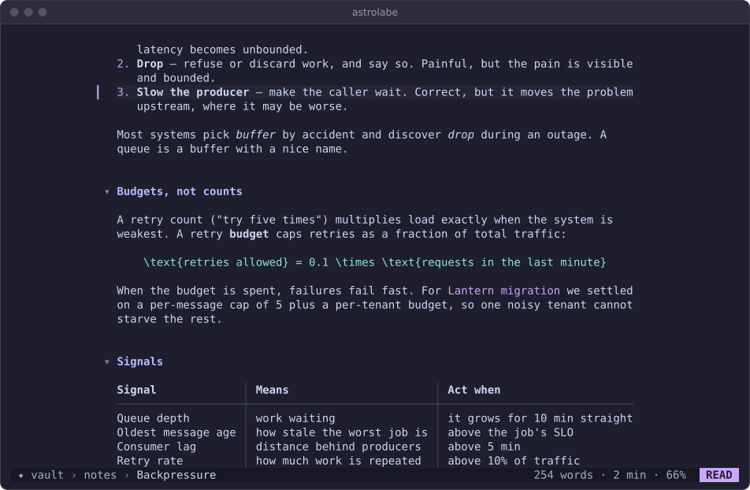

# Using Astrolabe CLI with the shell, tmux and Neovim

This page covers shell aliases, pipes and hooks, tmux popups, Neovim in both directions, and wiring Astrolabe CLI into rihla. Back to the [README](../README.md); the complete list of verbs is in the [shell reference](cli.md).

Astrolabe CLI is meant to sit next to the tools you already use. Everything on this page was run against Astrolabe CLI's sample vault with tmux 3.7, Neovim 0.12, bash and zsh. Where a snippet depends on a newer version of a tool, the text says so.

Three facts explain most of what follows:

- **Paths.** In a pipe Astrolabe CLI prints `path:line:text` or tab-separated columns. Paths are relative to the current directory when you are inside the vault, and absolute otherwise. `new`, `today -p`, `path` and `pick` always print absolute paths.
- **The terminal.** Interactive parts (`astrolabe`, `astrolabe pick`, `astrolabe new -o`) draw on `/dev/tty`. That is why `"$(astrolabe pick)"` works: the picker draws on the terminal while the chosen path goes to stdout.
- **Which vault.** Astrolabe CLI remembers your vault: the first `astrolabe -C DIR` (or `astrolabe vault DIR`) writes it to the config key `dir`, and every later run uses it from any directory, including commands started by tmux, Neovim, cron or a git hook, because they read the same config file. Two things still come before it: `ASTROLABE_DIR`, and a folder with `.obsidian/` or `.astrolabe/` above the current directory. `astrolabe vault` shows which rule applied ([full order](cli.md#which-vault)).

## Shell

### Aliases and functions

```sh
# ~/.bashrc or ~/.zshrc
export ASTROLABE_DIR="$HOME/notes"

alias n='astrolabe add'                      # n "idea"
alias nt='astrolabe add -t'                  # nt "reply to the vendor due:2026-10-09 !!"
alias nf='astrolabe find'                    # nf 'tag:runbook rollback'
alias nl='astrolabe ls -n 10'

# Pick a note and edit it in Neovim. If you cancel the picker (exit 130),
# Neovim does not open.
np() { f=$(astrolabe pick "$@") && nvim "$f"; }

# Create a note and edit it straight away.
nn() { nvim "$(astrolabe new "$@")"; }

# Today's daily note in your editor.
nd() { "${EDITOR:-vi}" "$(astrolabe today -p)"; }
```

`astrolabe new -e TITLE` and `astrolabe new -o TITLE` do the same as `nn` with `$EDITOR` and with the built-in editor.

### Pipes

```sh
# Capture from anything that writes to stdout. Several lines become one
# bullet, with the following lines indented.
pbpaste | astrolabe add                          # macOS clipboard
xclip -o -selection clipboard | astrolabe add    # X11
wl-paste | astrolabe add                         # Wayland

# Append under a heading in a specific note (created if missing).
astrolabe add -n Inbox --at Reading "The Quiet Machine, part II"

# A note from command output.
git log --oneline -20 | astrolabe new "Release notes draft"

# Every search hit in Neovim's quickfix list (path:line:text matches the
# default 'errorformat').
nvim -q <(astrolabe find deploy)

# Paths can contain spaces: read them line by line.
astrolabe ls -l --tag meeting | while IFS= read -r f; do grep -l rollback "$f"; done
astrolabe find -l rollback | tr '\n' '\0' | xargs -0 wc -w  # any xargs

# JSON for scripts.
astrolabe tasks --due --json | jq -r '.[] | select(.group=="overdue") | .text'
astrolabe find --json -n 5 pager | jq -r '.[].abs'

# Render a note for a pager or a mail.
astrolabe render "Lantern migration" | less -R
astrolabe render -w 72 Backpressure > backpressure.txt
astrolabe export Backpressure -o backpressure.html
```

### Exit codes in scripts

| Code | Meaning |
|---|---|
| 0 | success |
| 1 | nothing found (`find`, `ls`, `tasks`), or no note matches a name |
| 2 | usage error |
| 130 | cancelled (`Esc` in `astrolabe pick`) |

When nothing is found, the message goes to stderr only if stderr is a terminal, so a pipeline stays quiet:

```sh
if astrolabe find -l 'tag:oncall pager' >/dev/null; then echo "on-call notes mention the pager"; fi
```

### A commit log in the daily note

Save this as `.git/hooks/post-commit` in a repository and make it executable (`chmod +x`). Each commit adds one line, such as `- 14:02 astrolabe: Fix the retry budget`, to today's daily note:

```sh
#!/bin/sh
astrolabe add "$(basename "$(git rev-parse --show-toplevel)"): $(git log -1 --format=%s)" >/dev/null
```

To use it in every repository, put it in a template directory (`git config --global init.templateDir ~/.git-template`, with the file at `~/.git-template/hooks/post-commit`) or in a global hooks directory (`git config --global core.hooksPath ~/.githooks`). The second replaces each repository's own hooks.

The hook runs inside the repository. With a remembered vault the line goes there, even when the repository contains `.md` files. With nothing remembered, such a repository would itself be taken as the vault, and a repository with `.obsidian/` or `.astrolabe/` is always its own vault; set `ASTROLABE_DIR` in the hook if you need to override either.

### Cron or a systemd timer

`astrolabe add` touches only today's daily note, so it is safe to run unattended:

```sh
# crontab: a line every weekday at 9:00 with the open overdue count
0 9 * * 1-5  ASTROLABE_DIR=$HOME/notes astrolabe add "overdue: $(astrolabe tasks --json | jq '[.[] | select(.group=="overdue")] | length')"
```

## tmux

### Popups

```tmux
# ~/.tmux.conf

# prefix N: astrolabe in a popup, in the current pane's directory.
bind-key N display-popup -E -w 90% -h 90% -d '#{pane_current_path}' astrolabe

# prefix a / A: capture a line or a task without leaving what you are doing.
bind-key a display-popup -E -w 60% -h 3 -d '#{pane_current_path}' 'printf "capture: "; read -r line && [ -n "$line" ] && astrolabe add -- "$line" >/dev/null'
bind-key A display-popup -E -w 60% -h 3 -d '#{pane_current_path}' 'printf "task: "; read -r line && [ -n "$line" ] && astrolabe add -t -- "$line" >/dev/null'

# prefix F: the finder alone; the chosen note opens in a new window in Neovim.
bind-key F display-popup -E -w 80% -h 80% -d '#{pane_current_path}' 'f=$(astrolabe pick) && tmux new-window nvim "$f"'
```

Notes on these bindings:

- **Use single quotes.** Inside double quotes tmux expands `$line` itself while it reads the config, so the capture would always be empty.
- **`--` ends Astrolabe CLI's options**, so a capture that starts with `-` is still text.
- **Popups use tmux's global environment**, not your interactive shell's. If `astrolabe` is in `~/.local/bin` and the popup cannot find it, add `set-environment -g PATH "$HOME/.local/bin:$PATH"`, or write the full path to the binary. A remembered vault needs nothing here (it is in the config file); if you use `ASTROLABE_DIR` instead, add `set-environment -g ASTROLABE_DIR "$HOME/notes"` too.
- **Default bindings.** `N`, `a`, `A` and `F` have no default binding in tmux 3.7. `C` (customize mode) and `T` are worth avoiding if you use them.
- **The `-E` flag** closes the popup when Astrolabe CLI exits.
- **The `-d` flag** runs Astrolabe CLI in the pane's directory so that a project vault (`.obsidian/` or `.astrolabe/` above the pane) is found before the remembered one; elsewhere the remembered vault opens. With `ASTROLABE_DIR` set it makes no difference.

### Clipboard

Astrolabe CLI copies with OSC 52 when you press `Space y` (the note's wikilink), follow a URL, or yank to `"+` in the editor. tmux accepts OSC 52 from applications only with:

```tmux
set -g set-clipboard on
```

With that setting, tmux stores the copy in a paste buffer and passes it on to your terminal if the terminal supports OSC 52. `astrolabe doctor` run inside tmux prints the same reminder.

### Colour and hyperlinks

Astrolabe CLI detects truecolour from `COLORTERM`. tmux passes it through if your terminal sets it. If `astrolabe doctor` inside tmux shows 256 colours while the terminal itself has truecolour, add:

```tmux
set -as terminal-features ',*:RGB'
```

Hyperlinks (OSC 8) are emitted inside tmux 3.4 and later.

## Neovim

### Neovim as Astrolabe CLI's external editor

When you press `E` in the reader, Astrolabe CLI runs `$VISUAL` (else `$EDITOR`, else `vi`) through `sh` with `+LINE file`, so Neovim opens on the line under the reader's cursor. When Neovim exits, Astrolabe CLI reloads the note.

To make `i` (and `e`, `a`) open Neovim as well:

```ini
# ~/.config/astrolabe-cli/config
editor = external
```

With `editor = external`, `astrolabe new -e` and `E` behave the same way. The built-in editor is still used for `astrolabe new -o`.

Editors that take a line number:

| Editor | Arguments Astrolabe CLI passes |
|---|---|
| vi, vim, nvim, nano, emacs, emacsclient, micro, kak, and others | `+LINE file` |
| hx (Helix) | `file:LINE` |
| code, codium, subl, zed | `-g file:LINE` |
| anything else | `file` |

A value with arguments, such as `EDITOR="emacsclient -t"`, works because it is run through `sh`.

### Astrolabe CLI inside Neovim

Save this as `~/.config/nvim/lua/astrolabe.lua` and add `require("astrolabe")` to `init.lua`. It needs Neovim 0.11 or later. On older versions, replace `vim.fn.jobstart(cmd, { term = true, … })` with `vim.fn.termopen(cmd, { … })`.

```lua
-- astrolabe inside Neovim: a floating terminal, a picker that edits the chosen
-- note here, and :Capture.
local function float(cmd, on_exit)
  local w = math.floor(vim.o.columns * 0.9)
  local h = math.floor(vim.o.lines * 0.9)
  local buf = vim.api.nvim_create_buf(false, true)
  local win = vim.api.nvim_open_win(buf, true, {
    relative = "editor", style = "minimal", border = "rounded",
    width = w, height = h,
    row = math.floor((vim.o.lines - h) / 2), col = math.floor((vim.o.columns - w) / 2),
  })
  vim.fn.jobstart(cmd, {
    term = true,
    on_exit = function(_, code)
      if vim.api.nvim_win_is_valid(win) then vim.api.nvim_win_close(win, true) end
      if vim.api.nvim_buf_is_valid(buf) then vim.api.nvim_buf_delete(buf, { force = true }) end
      if on_exit then on_exit(code) end
    end,
  })
  vim.cmd.startinsert()
end

-- <leader>nn: the astrolabe reader in a float.
vim.keymap.set("n", "<leader>nn", function() float({ "astrolabe" }) end, { desc = "astrolabe" })

-- <leader>np: pick a note with astrolabe's finder and edit it here.
vim.keymap.set("n", "<leader>np", function()
  local out = vim.fn.tempname()
  float({ "sh", "-c", "astrolabe pick > " .. vim.fn.shellescape(out) }, function(code)
    local path = code == 0 and vim.fn.readfile(out)[1] or nil
    vim.fn.delete(out)
    if path and path ~= "" then
      vim.schedule(function() vim.cmd.edit(vim.fn.fnameescape(path)) end)
    end
  end)
end, { desc = "astrolabe pick" })

-- :Capture some text   appends a line to today's daily note.
vim.api.nvim_create_user_command("Capture", function(o)
  local r = vim.system({ "astrolabe", "add", "--", o.args }, { text = true }):wait()
  vim.notify(r.code == 0 and ("captured " .. vim.trim(r.stdout)) or vim.trim(r.stderr))
end, { nargs = "+" })
```

How the pieces work:

- **The picker** writes the chosen path to a temporary file. Inside a terminal buffer, stdout is the terminal itself, so the path could not be read from it.
- **`:Capture`** runs `astrolabe add` as a plain process. In a pipe, Astrolabe CLI prints `path:line`.
- **Nested Neovim.** If `EDITOR=nvim`, pressing `E` in the floating reader starts a second Neovim inside the float. That works, but you may prefer `i` and the built-in editor there.

Some more mappings you might add:

```lua
-- Today's daily note in the current window.
vim.keymap.set("n", "<leader>nd", function()
  vim.cmd.edit(vim.fn.fnameescape(vim.trim(vim.fn.system({ "astrolabe", "today", "-p" }))))
end, { desc = "astrolabe today" })

-- Search the vault into the quickfix list.
vim.api.nvim_create_user_command("Notes", function(o)
  vim.fn.setqflist({}, " ", { title = "astrolabe find " .. o.args,
    lines = vim.fn.systemlist({ "astrolabe", "find", o.args }) })
  vim.cmd.copen()
end, { nargs = "+" })
```

`:Notes` relies on `'errorformat'`, which matches `path:line:text` by default. If you run it from outside the vault, Astrolabe CLI prints absolute paths, which also open.

### Matching a Catppuccin setup

```ini
# ~/.config/astrolabe-cli/config
theme = mocha
```

`mocha` uses the Catppuccin Mocha colours: ground `#1e1e2e`, text `#cdd6f4`, accent mauve `#cba6f7`. If you run Neovim and tmux with a transparent background and want Astrolabe CLI to match, add `ground = off`. Astrolabe CLI then leaves the terminal's background alone and draws only the text colours. With `mocha`, Astrolabe CLI matches a Catppuccin Neovim and tmux.



## rihla

[rihla](https://github.com/ZahakJ/rihla) is a portable Neovim and tmux setup. These instructions are written for that repository. They assume only that it keeps a tmux config file, a Neovim config directory and some bootstrap or install script. Adapt the paths to its layout.

1. **Install Astrolabe CLI during bootstrap.** The installer needs no root, puts `astrolabe` in `~/.local/bin`, verifies the release checksum, and upgrades in place when run again:

   ```sh
   if ! command -v astrolabe >/dev/null 2>&1; then
     curl -fsSL https://raw.githubusercontent.com/ZahakJ/astrolabe-cli/main/install.sh | sh \
       || wget -qO- https://raw.githubusercontent.com/ZahakJ/astrolabe-cli/main/install.sh | sh
   fi
   ```

   For a machine without internet access, ship the binary for its platform next to rihla and run `sh install.sh --from ./astrolabe-linux-amd64`. To pin a release, set `ASTROLABE_VERSION=vX.Y.Z`, and to install elsewhere, set `ASTROLABE_BIN_DIR=DIR`.

2. **tmux.** Append the popup bindings from [Popups](#popups) to rihla's tmux config. If rihla does not already put `~/.local/bin` in tmux's global environment, add `set-environment -g PATH "$HOME/.local/bin:$PATH"`. Add `set -g set-clipboard on` if rihla does not set it.

3. **Neovim.** Copy `astrolabe.lua` (above) into rihla's Lua directory and require it from its `init.lua`. Before choosing `<leader>n…`, check rihla's existing leader mappings.

4. **Astrolabe CLI config.** rihla uses Catppuccin Mocha. Add a matching theme only when the user has not chosen one, so a later personal change survives a re-run of the bootstrap. Check for the `theme` line rather than the file: Astrolabe CLI creates the file itself when it remembers the vault.

   ```sh
   cfg="${XDG_CONFIG_HOME:-$HOME/.config}/astrolabe-cli/config"
   if ! grep -qs '^[[:space:]]*theme[[:space:]]*=' "$cfg"; then
     mkdir -p "$(dirname "$cfg")"
     printf '%s\n' 'theme = mocha' 'editor = external' >> "$cfg"
   fi
   ```

   With `editor = external` and `EDITOR=nvim`, `i` and `E` in the reader both open Neovim.

   Astrolabe CLI rewrites the `theme =` line when the user changes the theme with `Space T` or `:theme`, and the `dir =` line when it remembers a vault, keeping any other lines and comments. Do not manage this file with a symlink into rihla's repository unless that change should land in the repository.

5. **The vault.** If the notes are not in `~/notes`, the user runs `astrolabe -C DIR` (or `astrolabe vault DIR`) once; the vault is remembered in the config file, so the tmux popups, Neovim mappings and hooks find it from any directory without any environment. Do not export `ASTROLABE_DIR` from rihla by default: it would override what the user chose. It remains the right tool for a fixed vault per machine or per environment, and then it must also reach tmux's global environment (`set-environment -g`).

6. **Check.** Run `astrolabe doctor` inside tmux. It should show truecolour (or 256), Unicode glyphs, the vault you expect, and a config file with no warnings.
