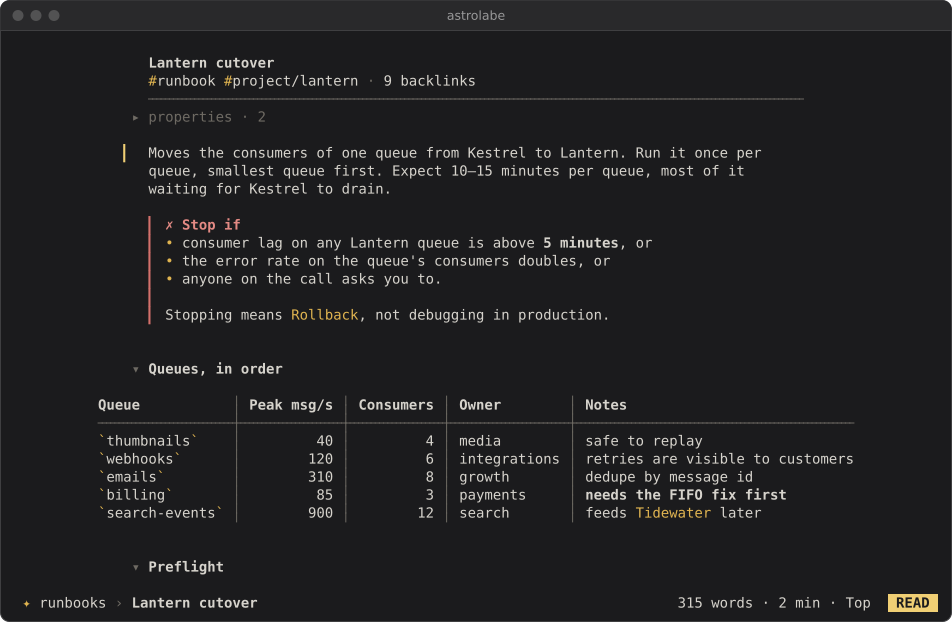
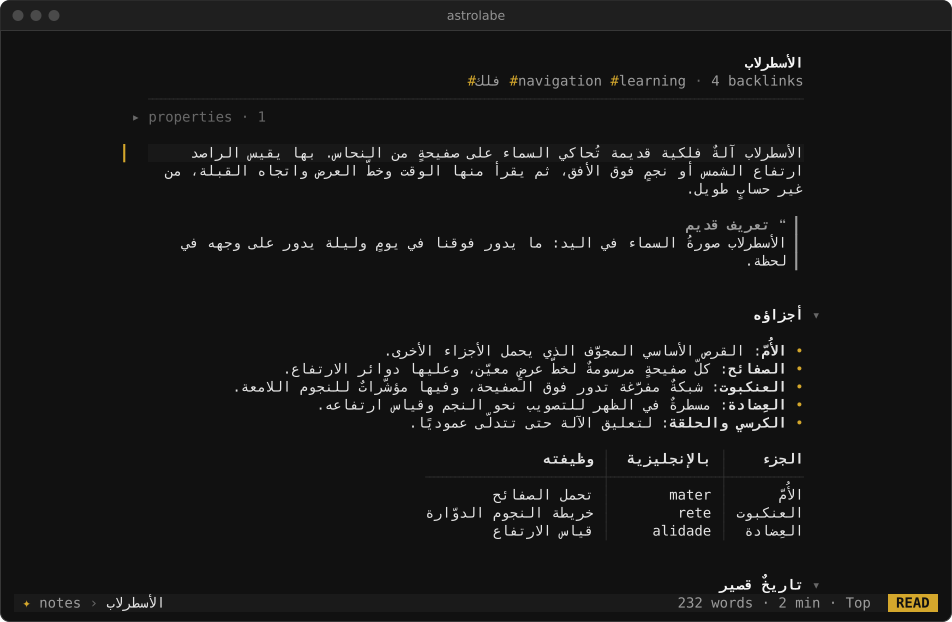
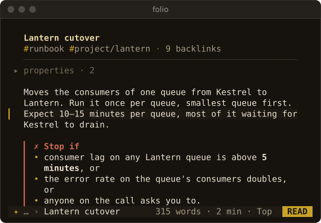

# Terminals

This page covers how Astrolabe CLI adapts to the terminal: colour depths, the ASCII fallback, right-to-left text and the three bidi modes, small windows, tmux and SSH, the mouse, suspend and minimal environments. Back to the [README](../README.md).

- **Colour.** Astrolabe CLI detects truecolour, 256, 16 or no colour. Themes are written in 24-bit colour and reduced to the nearest of the 256-colour cube and grey ramp when needed. At 16 colours Astrolabe CLI uses your terminal's own foreground and background, with yellow as the accent and bold, italic, underline and reverse doing the rest. It paints no backgrounds there, so the page is correct on both light and dark terminals. `NO_COLOR` and `TERM=dumb` turn colour off. `--color` forces a level.
- **Glyphs.** All glyphs come from common monospace fonts; DejaVu Sans Mono, Menlo and Consolas are the floor. Astrolabe CLI uses no Nerd Font glyphs and no emoji of its own. When the locale is not UTF-8, or with `--ascii`, an ASCII set takes over: bullets become `*`, task boxes `[ ]`, bars `|`, rules `-`, chevrons `v` and `>`, and the ellipsis `...`.
- **Right-to-left text.** A paragraph whose first strong character is Arabic or Hebrew is right-aligned, and its bullets and quote bars move to the right edge. Terminals handle right-to-left text in one of three ways, and Astrolabe CLI has a behaviour for each (`--bidi auto|on|off|runs`, config `bidi`):
  - `on`: most terminals (foot, Alacritty, WezTerm, xterm, Windows Terminal, …) do no bidi at all. Astrolabe CLI reorders each line into visual order itself and shapes Arabic into joined letter forms, which then read correctly in any terminal that has the glyphs.
  - `runs`: kitty does no bidi either, but it lays out every stretch of right-to-left letters in one font right to left while shaping, which reverses each Arabic word a second time. In this mode Astrolabe CLI still reorders and shapes, and emits each such stretch pre-reversed, so kitty's own reversal puts it back. Colours, highlights and the cursor stay on the right cells.
  - `off`: terminals that implement bidi themselves (VTE-based ones such as GNOME Terminal and Tilix, Konsole, Apple Terminal, mlterm) get the logical order untouched.

  `auto` (the default) picks `runs` in kitty (`TERM=xterm-kitty`, `KITTY_WINDOW_ID`, `TERM_PROGRAM=kitty`; inside tmux, Astrolabe CLI asks tmux which terminal is attached), `off` in the bidi terminals listed above, and `on` elsewhere. `astrolabe doctor` prints the mode it chose and why, and the last line of its test card shows whether Arabic reads joined and right to left. Piped output is never reordered. One limit in `runs` mode: if your main font itself contains the Arabic letter forms, kitty folds punctuation touching an Arabic word into the same run, and that punctuation can land on the other side of the word. Harakat on presentation forms are drawn by the terminal's font and can sit slightly off in some fonts.

  

- **Small windows.** The page needs 40×10. Below 60 columns the status bar keeps only the note name and the mode. Panels toggled on in a narrow window overlay the page instead of squeezing it. Below the minimum, Astrolabe CLI shows "window too small" until the window grows.

  

- **tmux and SSH.** Astrolabe CLI relies on no passthrough and works in `tmux display-popup`. Each frame is a diff of changed cells, sent in one write inside synchronized-update marks, so it does not flicker over slow links. Clipboard copies use OSC 52. Inside tmux they need `set -g set-clipboard on`: with tmux's default, `external`, tmux ignores OSC 52 sent by applications. Hyperlinks (OSC 8) are emitted for terminals known to support them, including tmux 3.4 and later.
- **Mouse.** Mouse reporting is on only while the TUI runs. The wheel scrolls. In the reader a click places the cursor, follows a link or toggles a fold chevron; in the editor a click places the cursor. To let the terminal handle selection instead, set `mouse = off`, or hold Shift while selecting, which most terminals honour.
- **Suspend.** `Ctrl-z` suspends Astrolabe CLI and `fg` brings it back with the screen restored. `SIGINT`, `SIGTERM` and `SIGHUP` restore the terminal before Astrolabe CLI exits, after saving any unsaved editor buffer (see [Data safety](obsidian.md#data-safety)); an internal crash restores the terminal too.
- **Minimal environments.** With `LANG=C` (or any non-UTF-8 locale) the interface glyphs fall back to the ASCII set, but note text is still read and written as UTF-8, so accented letters, Arabic and CJK in your notes come through unchanged if the terminal can show them. Under `TERM=dumb` the TUI still draws full-screen, without colour; the shell verbs print plain text there, as in a pipe.

What was and was not tested in real terminals is listed in [Verified on](verified.md).
