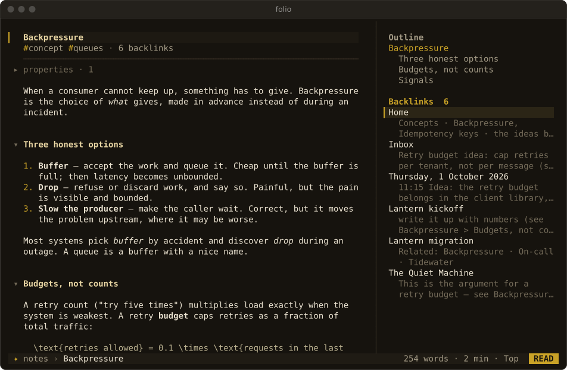
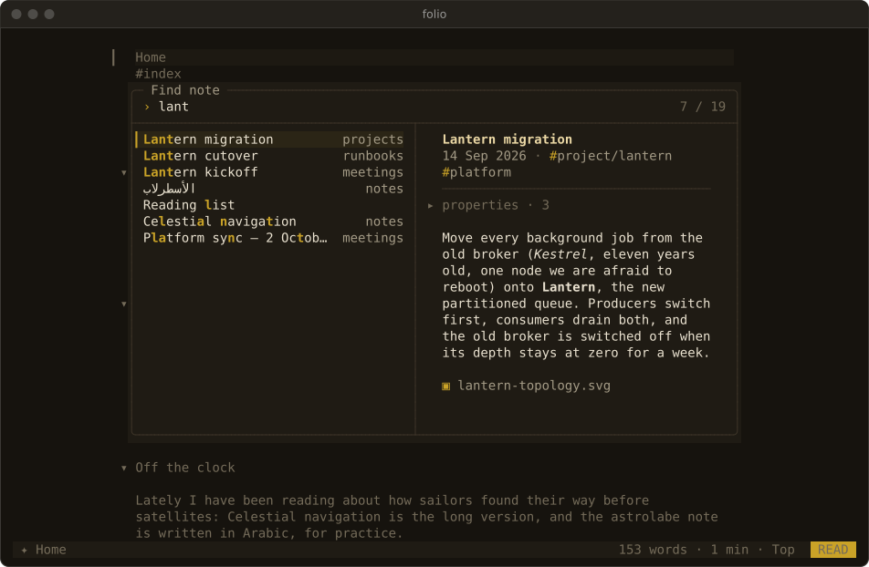
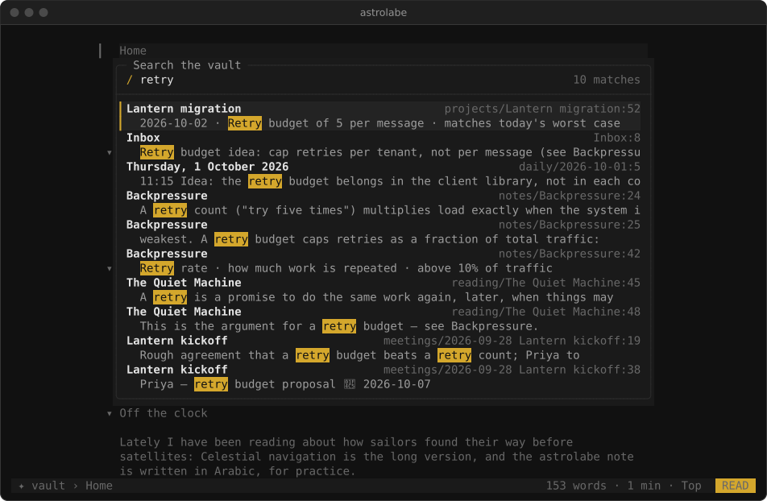
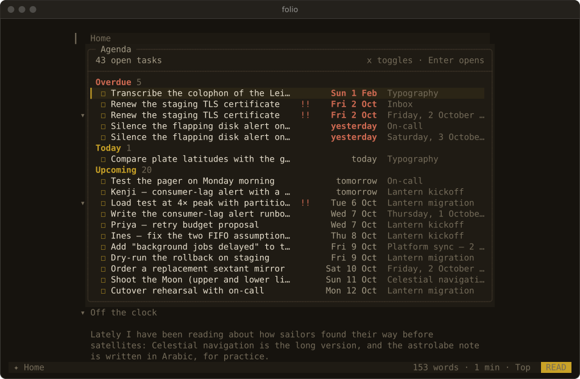
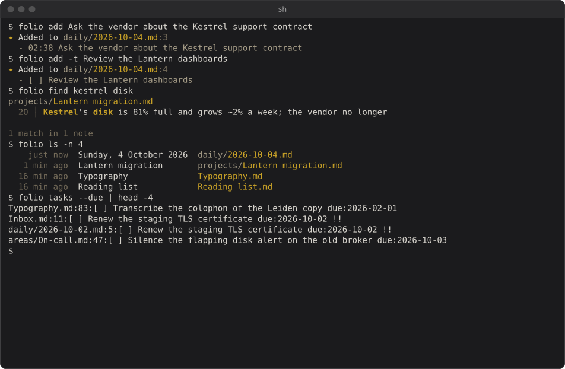

# The first five minutes

This page is the guided tour of Astrolabe CLI, step by step, with captures. Back to the [README](../README.md).

The repository includes a sample vault, so you can try everything below without touching your own notes. Its dates fall around early October 2026, so which tasks count as "overdue" depends on today's date.

1. **Install and check.** Run `astrolabe version`, then `astrolabe doctor`. `doctor` reports what Astrolabe CLI detected: colour depth, glyphs, bidi, which vault it chose and why, and your config file. It ends with a test card of colours and glyphs.

2. **Point it at notes.** Run Astrolabe CLI inside the sample vault (`git clone https://github.com/ZahakJ/astrolabe-cli && cd astrolabe-cli/examples/vault`), or inside your own Obsidian vault. Any folder that has `.obsidian/` or `.astrolabe/` above the current directory counts as a vault. Otherwise Astrolabe CLI uses `~/notes`. To make one vault the default everywhere, set `export ASTROLABE_DIR=~/notes` or put `dir = ~/notes` in the config file.

3. **Capture a thought from the shell.**

   ```console
   $ astrolabe add "call the plumber about the boiler"
   ✦ Added to daily/2026-10-04.md:3
     - 09:14 call the plumber about the boiler
   $ astrolabe add -t "renew passport due:2026-11-02 !!"
   ```

   Each capture appends exactly one line to today's daily note, which is created if needed. Nothing else in the file changes.

4. **Open the reader.** Run `astrolabe` with no arguments. It opens today's daily note if it exists, otherwise the last note you read, otherwise a home screen. To open a note by name, use `astrolabe Home` or `astrolabe "Lantern migration"`. A path, title, alias or unique fuzzy match all work. A gold `▎` in the left margin marks the cursor line:
   - `j` and `k` move it, and counts work (`5j`).
   - `Ctrl-d` and `Ctrl-u` move half a page; `gg` and `G` go to the top and bottom.
   - `]]` and `[[` jump between headings.
   - `za` folds the section under the cursor.

5. **Follow a link and come back.** Press `Tab` to highlight the next link and `Enter` to follow it. `Backspace` (or `Ctrl-o`, or `H`) goes back to the same place, and `L` goes forward again.
   - A broken link offers to create the note. A broken link to an attachment (`![[chart.png]]`, `report.pdf`) only says the attachment is missing.
   - A URL is shown and copied to the clipboard (OSC 52). Astrolabe CLI never opens it for you.

   

6. **Edit and save.**
   - Press `i` on any line and type. The built-in editor opens on that line's source in Insert mode, at the start of its text (after any list, task, quote or heading marker). `a` starts typing at the end of the line instead, and `e` opens the editor in Normal mode.
   - In the editor, Vim keys work as usual: `o` adds a new line, `A` appends, `u` undoes.
   - Press `Esc` twice to finish. The first `Esc` leaves Insert mode, and the second saves the file and returns to the reader at the same block.
   - To use your own editor, press `E` instead. It opens `$VISUAL` or `$EDITOR` at that line, and Astrolabe CLI reloads the note when you quit it.

   

7. **Find a note.** Press `Ctrl-p` (or `Space f`) to fuzzy-search titles, paths and aliases. With an empty query the finder lists your recent notes. Press `Enter` to open the selected note.

   

8. **Search the text.** Press `Space /` and type. Results appear as you type, with titles first, then headings, then body lines, each with its line of context. Press `Enter` to jump to the hit. Inside the current note, `/`, `n` and `N` search as in Vim.

   

9. **Tick a task.** Put the cursor on a task and press `x`. Astrolabe CLI rewrites the single character between the brackets in the file and nothing else.

10. **See the agenda.** Press `Space t` to list every open task in the vault, grouped as Overdue, Today, Upcoming and Undated. In the agenda, `x` toggles a task and `Enter` jumps to it.

    

11. **Capture without leaving the page.** Press `Space c`, type, and press `Enter`. `Tab` switches between a plain note line and a task.

    

To learn the rest, press `?` for every reader key, or press `Space` and wait a moment to see the leader keys. Press `q` to quit.

The [keymap](keymap.md) lists every key, and the [shell reference](cli.md) every verb.
