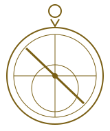

# Typography

This note is a **specimen sheet**: every construct the reader knows how to
draw, written about instruments, manuscripts and the people who navigated by
the stars. Read it at different widths to see how the page *breathes*.

Text can be **bold**, *italic*, ***both at once***, ~~struck through~~, or
==highlighted like a gilded initial==. Inline code such as `altitude = 90° − zenith`
sits on its own raised ground. A formula stays verbatim: $\tan\theta = h/d$.
Tags read as chips — #astronomy and #history/islamic — and footnotes as small
numbered marks.[^rete]

Links come in several kinds: a wikilink to [[Astrolabe]], one with a label
such as [[Astrolabe|the instrument itself]], one to a heading in another note
like [[Astrolabe#The rete]], a link to a [[Missing note]] that does not exist
yet, a Markdown link to [the reading list](Reading%20list.md), and an
external link to [a museum catalogue](https://example.org/collections/astrolabes "Catalogue").
A bare address is shortened when it is long:
https://example.org/archive/manuscripts/marginalia/folio-117-verso-with-annotations.html,
while a short one stays whole: <https://example.org>.

## Headings

Headings build hierarchy from weight and ink rather than size.

### A third-level heading

Bold in body ink, for sections within a section.

#### A fourth-level heading

##### A fifth-level heading

###### A sixth-level heading

The three smallest are quiet: italic and muted.

## Lists

An unordered list nests with changing bullets:

- The **mater**, the heavy body of the instrument
  - The **limb**, its graduated rim
    - Degrees, from 0 to 360
    - Hours, in two sets of twelve
  - The **throne**, where the ring hangs
- The **plates**, one for each latitude
- The **rete**, a pierced star map that turns above them

Ordered lists keep their numbers aligned when they reach two digits:

1. Hang the astrolabe from its ring.
2. Sight the sun through the alidade.
3. Read its altitude on the limb.
4. Turn the rete until the sun's place sits on that altitude.
5. Read the hour from the rule.
6. Note the ascendant on the horizon line.
7. Check the result against a second star.
8. Record both readings in the margin.
9. Reset the rete.
10. Repeat at the next hour.
11. Compare the two hours with the water clock.

A loose list leaves air between its items:

- Paper was cheaper than parchment by the fourteenth century.

- Vellum survives damp better than either, which is why so many
  instruments' treatises reached us on calfskin.

Tasks carry their state and their dates:

- [ ] Transcribe the colophon of the Leiden copy 📅 2026-02-01
- [ ] Compare plate latitudes with the gazetteer due:2026-10-04
- [/] Draw the rete's star pointers at full size @due(2030-05-20)
- [x] Photograph folios 12 to 19
- [-] Ask the archive for a raking-light image ⏫
- [ ] A task with a long description that has to wrap onto a second line so the hanging indent can be seen 📅 2031-01-09

## Quotations

> The instrument is a model of the heavens that fits in the hand; whoever
> learns to turn it learns to read the sky as a page.
>
> > A quotation inside a quotation adds a second bar.

## Callouts

> [!note]
> A note callout, with **emphasis** and a [[Astrolabe|link]] inside.

> [!abstract] Summary
> The astrolabe projects the celestial sphere onto a plane.

> [!info] Projection
> Stereographic projection keeps circles as circles.

> [!tip] Reading the limb
> Hold the instrument at eye level and let it hang freely.

> [!success] Calibrated
> The plate matches the latitude of the observatory.

> [!question] Who engraved it?
> The signature on the throne is worn away.

> [!warning]+ Fragile brass
> Do not force the rete; the pointers bend easily.

> [!failure] Missing plate
> The plate for the southern latitudes was never found.

> [!danger] Corrosion
> Green spots on the mater are active bronze disease.

> [!bug] Misprint
> The facsimile prints the zodiac scale backwards.

> [!example] Worked example
> At noon the sun stood 52° above the horizon.

> [!quote] From a treatise
> Know that the astrolabe is the key to the heavens.

> [!todo]- Folded by default
> This body is hidden until the callout is opened.

> [!tip] Nesting
> A callout can hold richer structure:
>
> > A quotation inside the callout, with a list:
> >
> > - first item
> >   - a nested item with `code`
> > - second item

## Code

A Go function:

```go
// Altitude converts a zenith distance in degrees to an altitude.
func Altitude(zenith float64) float64 {
	if zenith < 0 || zenith > 180 {
		return math.NaN() // out of range
	}
	return 90 - zenith
}
```

Python, with a line far wider than the block so it has to be clipped at the edge:

```python
def hours(altitude: float, latitude: float = 52.1) -> str:
    """Return the unequal hour for a solar altitude."""
    table = {"dawn": 0, "noon": 6, "dusk": 12}  # a lookup that is deliberately long enough to run past the edge of the block
    return f"{altitude:.1f}° at {latitude}"
```

```sh
# fetch the scans and count them
for f in scans/*.tif; do
  echo "processing $f" && convert "$f" -resize 50% "small/${f##*/}"
done
```

```json
{ "name": "Astrolabe", "plates": 4, "signed": false, "maker": null }
```

```yaml
instrument: astrolabe
plates: 4   # one per latitude
latitudes: [30, 36, 42, 48]
signed: false
```

```diff
--- a/catalogue.md
+++ b/catalogue.md
@@ -1,3 +1,3 @@
 The rete has 22 star pointers.
-The plate is for latitude 36.
+The plates are for latitudes 30 to 48.
```

```sql
SELECT maker, count(*) AS n FROM instruments WHERE year < 1500 GROUP BY maker;
```

```rust
fn main() { let stars: Vec<&str> = vec!["Aldebaran", "Vega"]; println!("{}", stars.len()); }
```

```lua
local function hour(alt) return alt / 15 end -- crude
```

```c
#include <stdio.h>
int main(void) { printf("%d plates\n", 4); return 0; }
```

```ts
const plates: number[] = [30, 36, 42, 48]; // latitudes
```

```
An unlabelled block is shown without highlighting.
```

## Tables

| Instrument | Century | Material | Plates |
|:-----------|:-------:|---------:|-------:|
| Astrolabe  | 10th    | Brass    | 4      |
| Quadrant   | 13th    | Wood     | —      |
| Armillary  | 16th    | Bronze   | 0      |

A table mixing scripts, with inline markup in its cells:

| Term | Arabic | Chinese | Note |
|------|--------|---------|------|
| Star | نجم | 星 | *bright* things |
| Ruler | مسطرة | 尺 | the `alidade` |
| Spider | عنكبوت | 蜘蛛 | the [[Astrolabe#The rete|rete]] |

A table too wide for the measure shrinks its widest columns and wraps:

| Folio | Description | Condition | Remarks on the hand and the decoration |
|-------|-------------|-----------|----------------------------------------|
| 12r | Opening of the treatise, with a large gilded initial and a border of vine scrolls in blue and red | Good, slight cockling | The main hand is a careful naskh with vowels throughout |
| 13v | Diagram of the plate for the latitude of the copying town | Faded | Red ink has turned brown; the diagram was ruled with a stylus first |

A table with many narrow columns falls back to records on a small screen:

| Star | Magnitude | Right ascension | Declination | Constellation | Arabic name | Pointer |
|------|-----------|-----------------|-------------|---------------|-------------|---------|
| Aldebaran | 0.9 | 4h 36m | +16° 31′ | Taurus | al-Dabarān | yes |
| Vega | 0.0 | 18h 37m | +38° 47′ | Lyra | al-Nasr al-Wāqiʿ | yes |

## Rules and breaks

Above the ornament.

---

Below the ornament. A line can be broken here<br>and continue on the next.

## Images and embeds



![[star-chart.svg]]

![[Astrolabe]]

## Mathematics

$$
\lambda = \arctan\left(\frac{\sin\alpha\cos\varepsilon + \tan\delta\sin\varepsilon}{\cos\alpha}\right)
$$

## Raw HTML and comments

<div class="marginalia">
  A block of HTML is shown verbatim and faint.
</div>

%% This comment is hidden from the page. %%

<!-- So is this one. -->

Text continues after the hidden comments, %%even inline ones%% unbroken.

## النص العربي

الأسطرلاب آلة فلكية قديمة استعملها الفلكيون والملاحون لقياس ارتفاع الشمس
والنجوم، ومعرفة الوقت والاتجاه. وكانت تصنع من **النحاس** وتنقش عليها خطوط
الأفق والبروج.

- الأم، وهي جسم الآلة
- الصفائح، لكل عرض صفيحة
  - العنكبوت فوقها
- العضادة للرصد

> قال الصوفي: من عرف الأسطرلاب عرف السماء.

1. علّق الآلة من حلقتها.
2. ارصد الشمس بالعضادة.

[^rete]: The rete is the openwork plate that carries the star pointers; its
    name comes from the Latin for a net.
